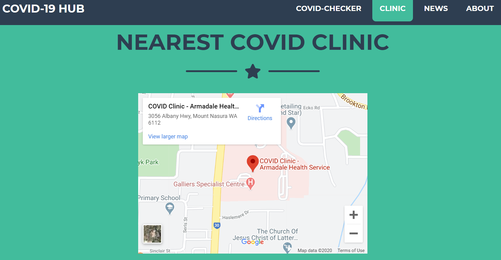
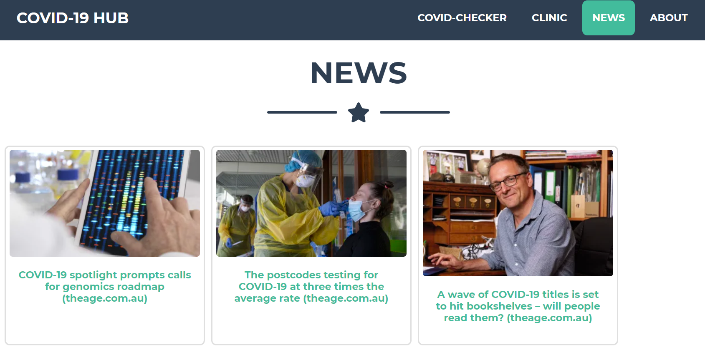

# Lucky_Nine Project

COVID-19 HUB (Project 1 for Lucky-Nine Team - Dhanya, Osmond and John).

This is the URL for the application: https://ong-osmond.github.io/Lucky_Nine/

Our one stop shop for CORONAVIRUS info is the website to go to during this time of pandemic. 
Our main feature is the COVID-CHECKER where you can submit symptoms and get free advice on whether or not you have been struck down with COVID-19! If you are one of the unlucky few you then you can find your nearest COVID clinic to cleanse your vessel. Otherwise, just browse the latest news that's served dynamically through an API.

Features:

1. Integration with the INFERMEDICA API using the free COVID-19 interview flow.

2. Google Maps integration to display your nearest local COVID Clinic.

3. Integration with ip-geolocation-ipwhois-io.p.rapidapi.com, covid-19-news.p.rapidapi.com and cors-anywhere.herokuapp.com for news based on user's IP provider (country-specific).

